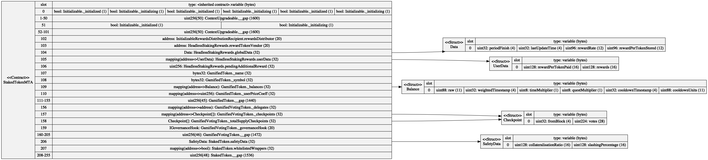
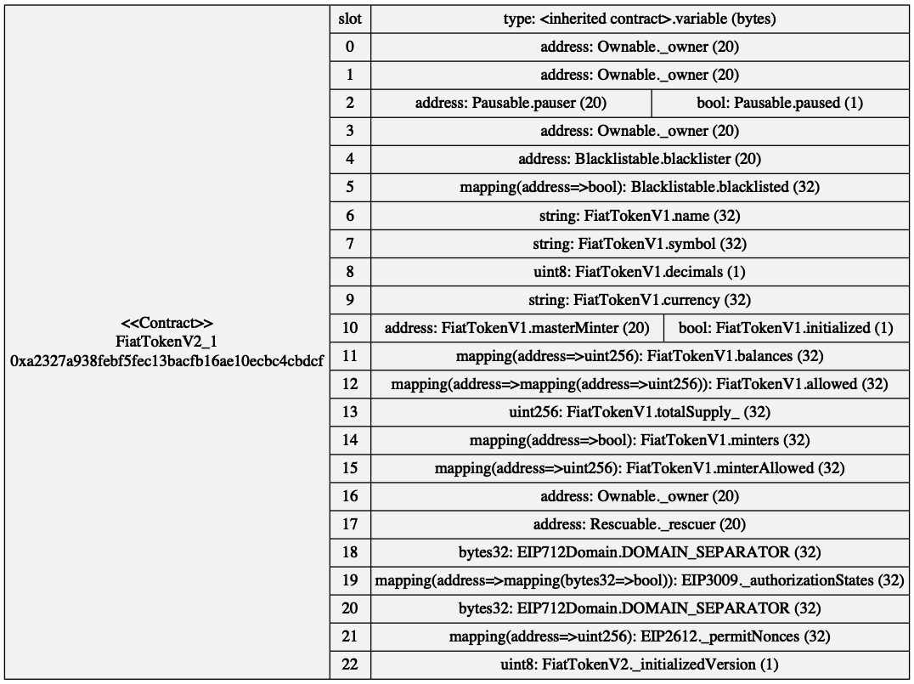
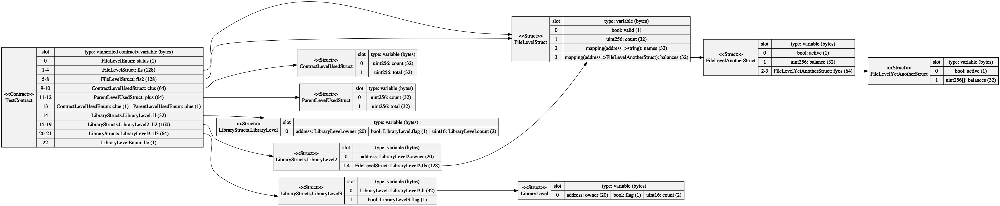

# Example Storage Diagrams

## mStable MTA Staking V2

Any struct used in storage is shown displaying their slot configurations. These structs can be a type of a storage variable or using in a mapping or array.



The above was generated against a local copy of the [mStable contracts](https://github.com/mstable/mStable-contracts/pull/220) repository.
The `-c StakedTokenMTA` option is used to specify the base contract the storage should be generated for.
The `-i build,_flat` option ignores the Solidity files in the `build` and `_flat` subfolders.

```
sol2uml storage -v -c StakedTokenMTA -i build,_flat -f png -o examples/storage/StakedTokenMTA.png ../mStable-contracts
```

## USDC

USDC storage slots from the [verified source code](https://etherscan.io/address/0xa2327a938febf5fec13bacfb16ae10ecbc4cbdcf#code) on Etherscan.



Generated from running
```
sol2uml storage -v -f png -o examples/storage/usdc.png 0xa2327a938febf5fec13bacfb16ae10ecbc4cbdcf
```

## Structs of structs

This is a contrived example where structs depend on other structs [fileLevel.sol](../../src/contracts/fileLevel.sol).



